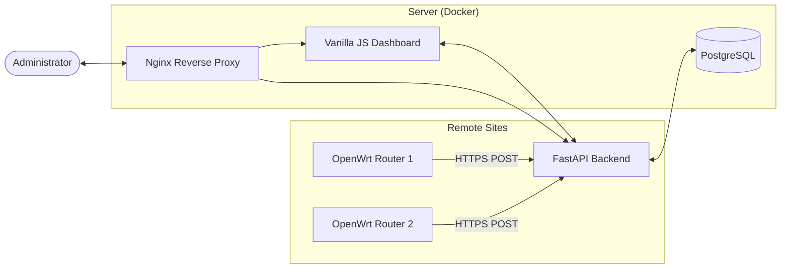

# NetTrack — Network-Based Location Tracking System

NetTrack is a real-time monitoring and location intelligence system designed to track Wi-Fi devices across multiple OpenWrt-powered access points. It provides a centralized dashboard for visualizing device distribution, signal strength, and network density.


## 🚀 Features

- **Live Interactive Map:** Visualize Access Points and connected devices in real-time using Leaflet and Marker Clustering.
- **Real-Time Analytics:** Track active device counts, AP health, and signal density.
- **Cross-Platform Compatibility:** Lightweight shell script for OpenWrt routers and a dockerized backend/frontend for easy server deployment.
- **Advanced UI:** Modern, responsive dashboard with Dark/Light mode support, live pulse indicators, and smooth animations.
- **Signal Tracking:** Monitors signal strength (dBm) and bitrates for every connected client.

## 🏗️ Architecture

The system consists of three main components:

1.  **NetTrack Agent (`send_data.sh`):** A shell script running on OpenWrt routers that collects client data using `iw` and reports it to the backend.
2.  **Backend (FastAPI):** A Python-based REST API that processes incoming reports from APs and serves data to the dashboard.
3.  **Frontend (Vanilla JS):** A high-performance dashboard that visualizes network data using Leaflet.js and Chart.js.



## 🛠️ Installation

### 1. Server Setup (Docker)

Ensure you have [Docker](https://docs.docker.com/get-docker/) and [Docker Compose](https://docs.docker.com/compose/install/) installed.

1.  Navigate to the `wifi-tracker` directory:
    ```bash
    cd wifi-tracker
    ```
2.  Configure your environment:
    ```bash
    cp .env.example .env
    # Edit .env with your database credentials
    ```
3.  Start the stack:
    ```bash
    docker compose up -d
    ```

The dashboard will be available at `http://your-server-ip`.

### 2. OpenWrt Agent Setup

1.  Edit `wifi-tracker/openwrt/send_data.sh`:
    - Set `SERVER` to your server's IP or domain.
    - Set `AP_ID`, `LAT`, and `LNG` for the specific access point.
    - Verify the `IFACE` (usually `wlan0` or `phy0-ap0`).
2.  Upload the script to your router:
    ```bash
    scp wifi-tracker/openwrt/send_data.sh root@<router-ip>:/usr/bin/send_data.sh
    ```
3.  SSH into the router and start the agent:
    ```bash
    ssh root@<router-ip>
    chmod +x /usr/bin/send_data.sh
    /usr/bin/send_data.sh &
    ```

To run automatically on boot, add the script to `/etc/rc.local` or create a crontab entry using the `--once` flag.

## ⚙️ Configuration

### Environment Variables (.env)

| Variable | Description | Default |
| :--- | :--- | :--- |
| `DATABASE_URL` | SQLAlchemy connection string | `postgresql://user:pass@db:5432/wifi_db` |
| `POSTGRES_USER` | Database username | `admin` |
| `POSTGRES_PASSWORD` | Database password | `secret` |
| `POSTGRES_DB` | Database name | `wifi_db` |

## 🛠️ Tech Stack

- **Frontend:** HTML5, Vanilla JavaScript, CSS3 (Custom Variables), Leaflet.js, Chart.js.
- **Backend:** Python 3.11, FastAPI, SQLAlchemy (PostgreSQL).
- **Deployment:** Docker, Docker Compose, Nginx.
- **Agent:** POSIX Shell, `curl`, `iw`.

## 📄 License

This project is licensed under the MIT License - see the LICENSE file for details.
